# 🔐 Auth App - Déploiement Kubernetes & Haute Disponibilité

Projet réalisé dans le cadre du cours de **Clusterisation de conteneurs**.
Ce dépôt présente une application web (Node.js/Three.js) conteneurisée et déployée sur un cluster Kubernetes (Infomaniak) avec une architecture de base de données MongoDB hautement disponible.

## 🏗️ Architecture Kubernetes

L'infrastructure a été pensée pour la résilience et la sécurité, en utilisant les concepts avancés de Kubernetes :

* **Namespace `authapp` :** Toutes les ressources applicatives sont isolées dans le namespace `authapp` pour une meilleure organisation et séparation des responsabilités vis-à-vis des composants système.

* **Base de données (MongoDB - StatefulSet) :** Au lieu d'un simple Deployment, Mongo tourne sur un **StatefulSet** (3 réplicas). Cela garantit une identité réseau stable (`mongo-0`, `mongo-1`, `mongo-2`) et attache un volume persistant (PVC) unique à chaque pod. Un **Headless Service** (`ClusterIP: None`) gère le réseau interne. Les 3 instances forment un **ReplicaSet MongoDB** (1 Primary, 2 Secondary) pour la tolérance aux pannes.
* **Backend (Node.js/Express - Deployment) :** Déployé avec un Replica géré par un Deployment. Il est exposé uniquement à l'intérieur du cluster via un service **ClusterIP** pour des raisons de sécurité. Il se connecte au ReplicaSet Mongo via une URI multiple.
* **Frontend (Nginx/Three.js - Deployment) :** Déployé en tant que Deployment, exposé à l'intérieur du cluster via un service **ClusterIP**. Le trafic public passe par l'Ingress Controller qui route vers ce service.

* **Ingress Controller (ingress-nginx) :** Point d'entrée unique du cluster, installé via Helm. Route les requêtes `/api/*` vers le backend et `/` vers le frontend sur une seule IP publique.

* **Monitoring (Uptime Kuma - Deployment + PVC) :** Interface web de monitoring déployée avec un Deployment et un volume persistant (PVC) pour conserver l'historique. Accessible en interne via port-forward (`kubectl port-forward service/uptime-kuma 3001:3001 -n authapp`). Surveille la disponibilité du frontend, du backend et de MongoDB en temps réel. 

---

## ☁️ Préparation de l'infrastructure (Infomaniak)

Pour héberger ce cluster, nous utilisons l'offre Cloud Computing d'Infomaniak. Voici les étapes détaillées pour recréer l'environnement de zéro :

### 1. Création du compte et du service
* Créez un compte sur le site d'Infomaniak.
* Souscrivez à l'offre **Cloud Computing** (qui propose une offre d'essai ou une facturation à l'usage très accessible pour les étudiants).
* Suivez les étapes, notamment la validation du numéro de téléphone et finalisez votre inscription en choisissant uniquement les options gratuites (à date du 31/03/2026 il y a une offre d'essai **300,00 € offerts pour découvrir notre Public Cloud !**).

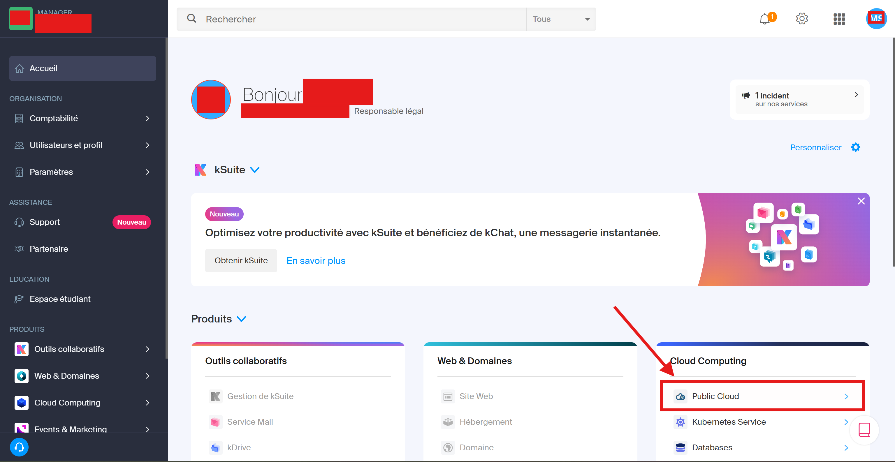

### 2. Création du cluster Kubernetes
* Dans votre interface Cloud Computing, naviguez vers la section **Kubernetes** dans le menu.
* Cliquez sur **Créer un cluster**.
* Choisissez l'option pour créer un cluster **vide** (sans nœuds pré-alloués). Le plan de contrôle (Control Plane) de ce cluster est gratuit.

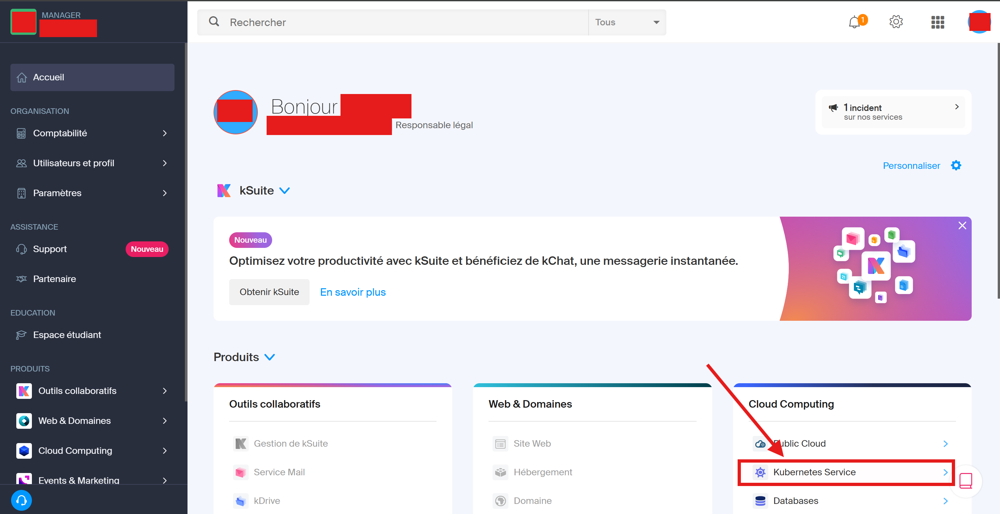
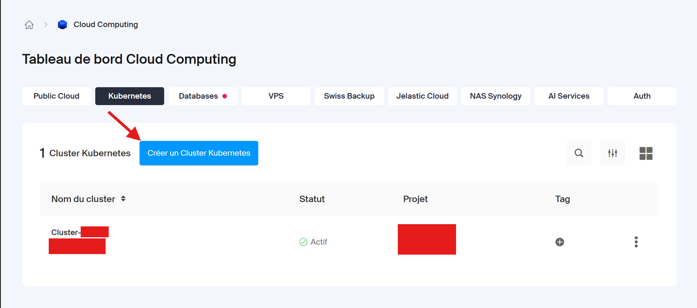

* Sélectionnez le produit et le projet auquel vous souhaitez ajouter un cluster, ou créez-en un nouveau.
  
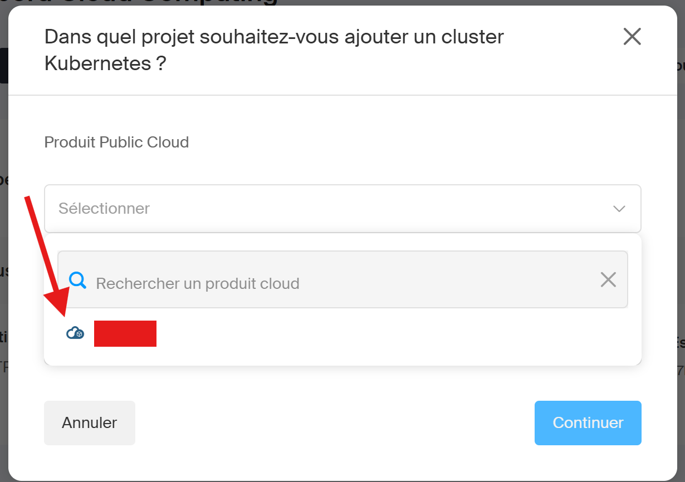
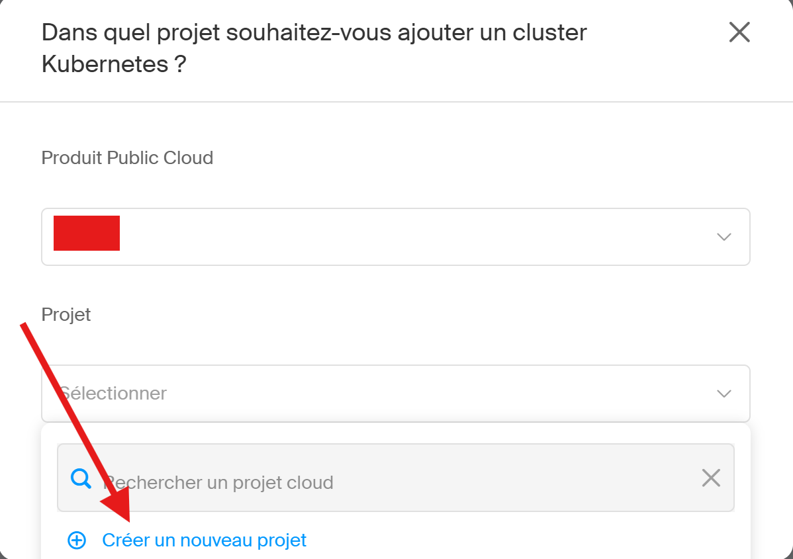

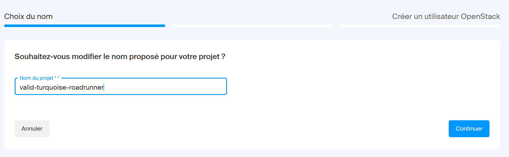
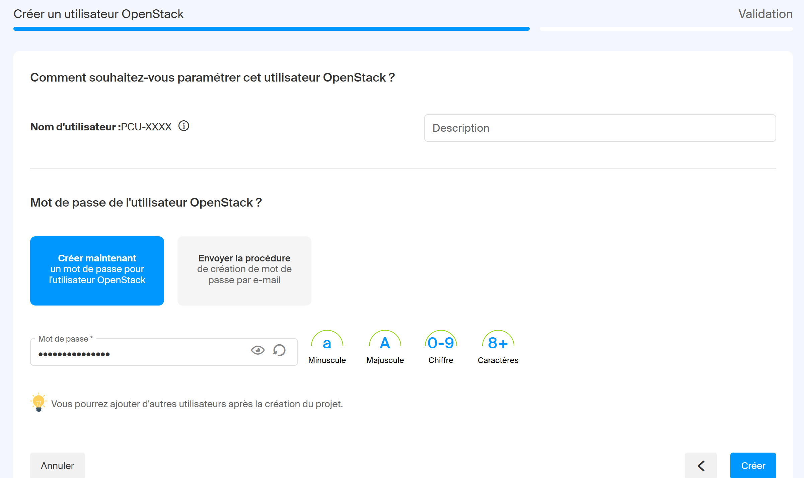

* Après la validation, le projet sera créé en quelques minutes. Vous verrez son statut passer de *Provisioning* à *Running*.
* Ensuite cliquez sur votre projet pour accéder à son tableau de bord de gestion.


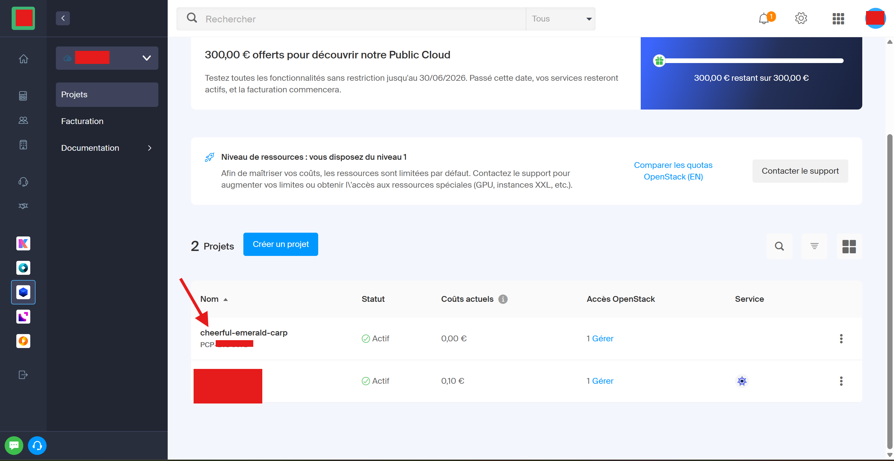

* Dans le tableau de bord crée un nouveau cluster Kubernetes.

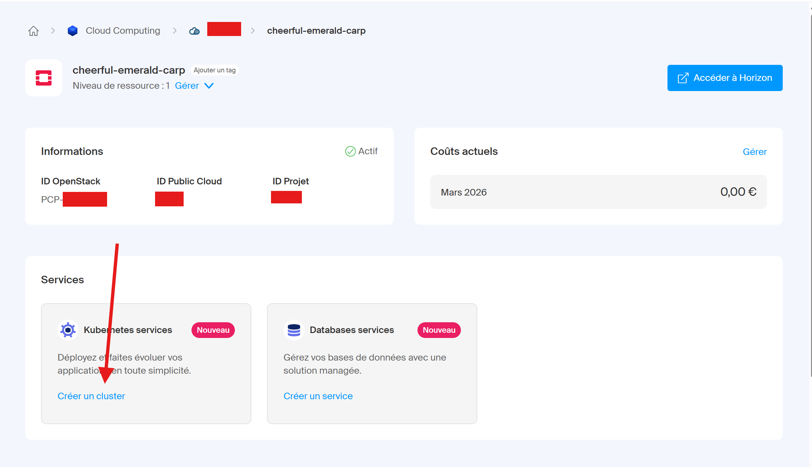

* Choisissez un cluster mutualisé pour ce projet étudiant, qui est plus économique.

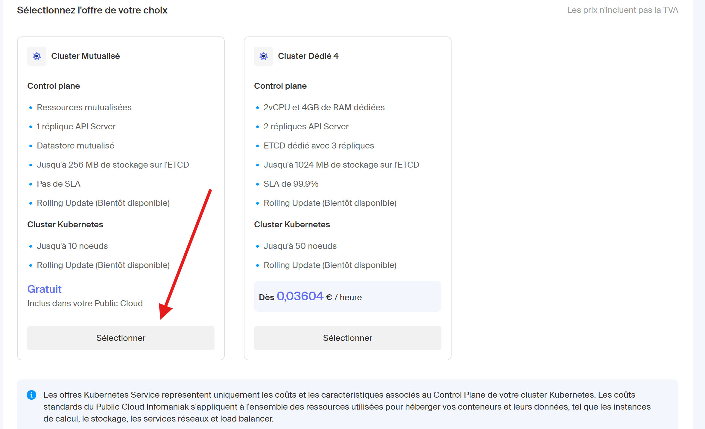
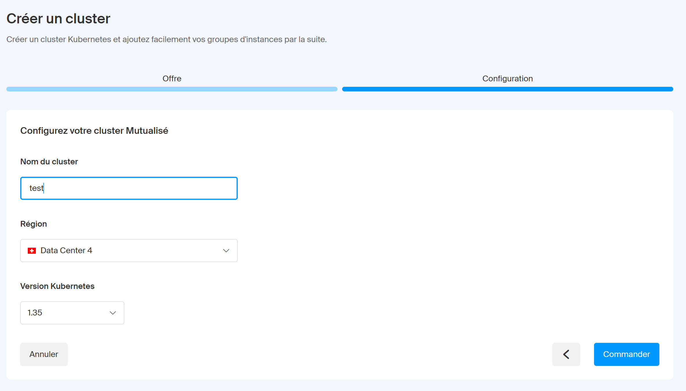

* Après validation, le cluster sera créé en quelques minutes. Vous verrez son statut passer de *Provisioning* à *Running*.

* Téléchargez le fichier de configuration **kubeconfig** fourni par Infomaniak. Ce fichier est votre clé d'accès pour interagir avec le cluster via `kubectl`.

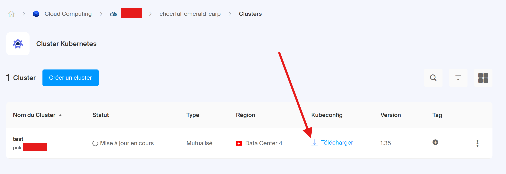

* Une fois le cluster prêt, cliquez sur le cluster pour accéder à son tableau de bord de gestion. C'est ici que vous pourrez ajouter un groupe d'instances pour faire tourner vos applications.

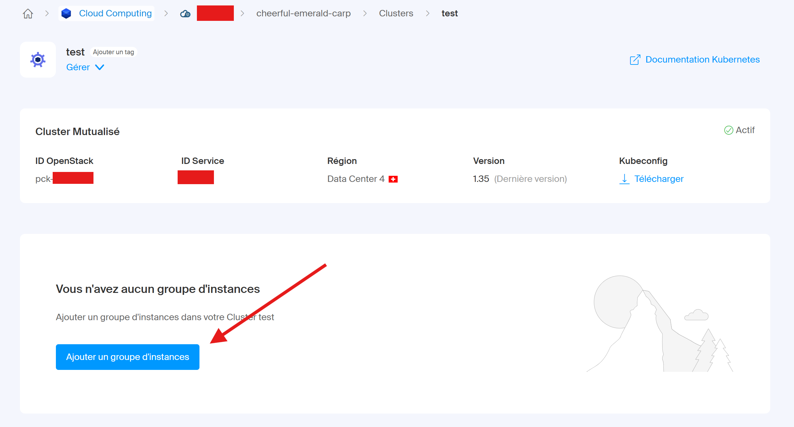
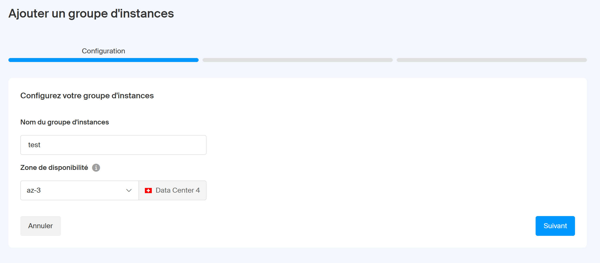

* Sélectionnez le type d'instance le moins cher pour ce projet étudiant (ex: `a1-ram2-disk20-perf1`) et configurez le nombre d'instances à 1 et en manuelle.

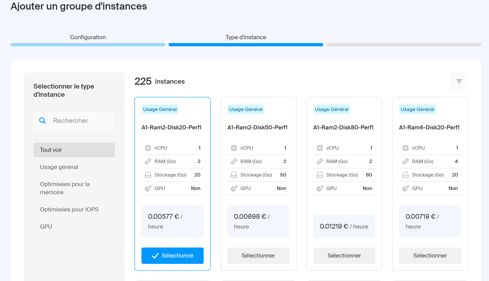
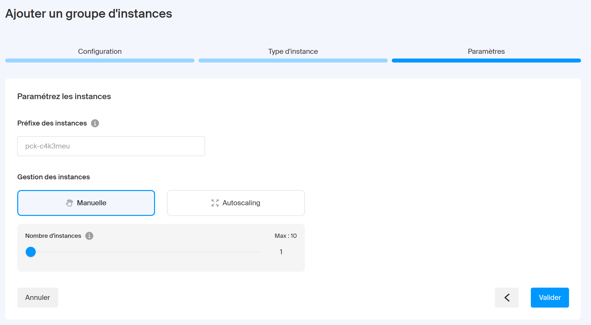

### 3. Récupération des accès (Kubeconfig)
* Une fois le cluster créé, repérez l'option pour télécharger le fichier de configuration **kubeconfig** fourni par Infomaniak. Ce fichier est votre clé d'accès.
* Liez ce fichier à votre outil en ligne de commande local (`kubectl`) :
  ```powershell
  # Sur Windows (PowerShell)
  $env:KUBECONFIG="chemin/vers/votre/fichier-kubeconfig"
  ```


### 4. Création d'une instance (Nœud Worker)
Kubernetes a maintenant besoin d'une machine physique/virtuelle pour faire tourner les conteneurs.
* Allez dans les paramètres de votre cluster et créez un nouveau groupe d'instances.
* **Nom :** Donnez un nom explicite à votre nœud (ex: `instance-worker-1`).
* **Gabarit (Type) :** Choisissez l'instance la moins chère pour ce projet étudiant (ex: `a1-ram2-disk20-perf1`).
* **Gestion des instances :** Sélectionnez la configuration **Manuelle**.
* **Nombre d'instances :** Réglez le curseur sur **1**.
* Validez. Infomaniak va afficher le statut *Ajustement des instances* (voir capture). Une fois l'instance active, votre nœud apparaîtra dans `kubectl get nodes` au statut `Ready`.


---

## 🚀 Guide de déploiement (Kubernetes)

### 0. Création du namespace et configuration du contexte
Toutes les ressources sont déployées dans un namespace dédié `authapp` :
```bash
kubectl create namespace authapp
kubectl config set-context --current --namespace=authapp
```

### 1. Prérequis
* `kubectl` installé sur votre machine.
* `helm` installé sur votre machine.
* Un cluster Kubernetes opérationnel.
* Le fichier kubeconfig configuré :
```powershell
    $env:KUBECONFIG="chemin/vers/votre-kubeconfig"
```

### 2. Installation de l'Ingress Controller
Le cluster nécessite un Ingress Controller pour exposer les applications. Installez ingress-nginx via Helm :
```bash
helm repo add ingress-nginx https://kubernetes.github.io/ingress-nginx
helm repo update
helm install ingress-nginx ingress-nginx/ingress-nginx \
  --namespace ingress-nginx \
  --create-namespace \
  --set controller.resources.requests.cpu=50m \
  --set controller.resources.requests.memory=64Mi
```
Attendez l'IP externe :
```bash
kubectl get service ingress-nginx-controller -n ingress-nginx -w
```

### 3. Configuration des Secrets (Sécurité)
Créez un fichier `k8s/00-secrets.yaml` (⚠️ **à ajouter à votre `.gitignore`, ne jamais le commiter**) basé sur ce modèle :
```yaml
apiVersion: v1
kind: Secret
metadata:
  name: backend-secrets
  namespace: authapp
type: Opaque
stringData: 
  JWT_SECRET: "colle_ta_chaine_openssl_ici"
  MONGO_URI: "mongodb://mongo-0.mongo.authapp.svc.cluster.local:27017,mongo-1.mongo.authapp.svc.cluster.local:27017,mongo-2.mongo.authapp.svc.cluster.local:27017/authdb?replicaSet=rs0"
```
Appliquez-le sur le cluster :
```bash
kubectl apply -f k8s/00-secrets.yaml
```

### 4. Déploiement de la base de données (StatefulSet)
```bash
kubectl apply -f k8s/01-mongo.yaml
kubectl get pods -w
```
Attendez que les 3 pods (`mongo-0`, `mongo-1`, `mongo-2`) soient au statut `1/1 Running`.

### 5. Initialisation du ReplicaSet MongoDB (Étape cruciale)
```bash
kubectl exec -it mongo-0 -n authapp -- mongosh --eval "rs.initiate({_id: 'rs0', members: [{_id: 0, host: 'mongo-0.mongo.authapp.svc.cluster.local:27017'}, {_id: 1, host: 'mongo-1.mongo.authapp.svc.cluster.local:27017'}, {_id: 2, host: 'mongo-2.mongo.authapp.svc.cluster.local:27017'}]})"
```
Vérifiez l'élection (relancez jusqu'à voir PRIMARY) :
```bash
kubectl exec -it mongo-0 -n authapp -- mongosh --eval "rs.status().members.map(m => m.name + ' : ' + m.stateStr)"
```

### 6. Déploiement des applications
```bash
kubectl apply -f k8s/02-backend.yaml
kubectl apply -f k8s/03-frontend.yaml
kubectl apply -f k8s/04-ingress.yaml
kubectl apply -f k8s/05-uptime-kuma.yaml
kubectl get pods -w
```
Attendez que tous les pods soient `1/1 Running`.

### 7. Accès à l'application
```bash
kubectl get service ingress-nginx-controller -n ingress-nginx
```
* Application : `http://<EXTERNAL-IP>`
  
* Uptime Kuma (monitoring) : lancez dans un terminal séparé :
```bash
kubectl port-forward service/uptime-kuma 3001:3001 -n authapp
```
Puis ouvrez `http://localhost:3001`

---

## 🧪 Tester la résilience (Haute Disponibilité)

Pour prouver l'efficacité du cluster, simulez la perte de l'instance MongoDB principale :
1. Identifiez le pod PRIMARY : `kubectl exec -it mongo-0 -n authapp -- mongosh --eval "rs.status().members.map(m => m.name + ' : ' + m.stateStr)"`
2. Détruisez-le : `kubectl delete pod mongo-0 -n authapp`
3. Constatez l'auto-guérison : `kubectl get pods -n authapp -w`
4. Le trafic est redirigé vers le nouveau PRIMARY élu sans interruption.

---

## ⚖️ Mise à l'échelle (Scaling) & Load Balancing

### 1. Augmenter le nombre de réplicas
```bash
kubectl scale deployment authapp-backend --replicas=3 -n authapp
kubectl scale deployment authapp-frontend --replicas=3 -n authapp
```

### 2. Observer la répartition de charge en direct
```bash
# Backend
kubectl logs -f -l app=authapp-backend --prefix -n authapp
# Frontend
kubectl logs -f -l app=authapp-frontend --prefix -n authapp
```

### 3. Résultat attendu
```text
[pod/authapp-backend-8cfc...-7v6gr] Requête reçue : POST /api/auth/login
[pod/authapp-backend-8cfc...-x2qw4] Requête reçue : POST /api/auth/register
[pod/authapp-backend-8cfc...-j88dt] Requête reçue : GET /api/auth/me
```

### 4. Retour à la configuration initiale
```bash
kubectl scale deployment authapp-backend --replicas=1 -n authapp
kubectl scale deployment authapp-frontend --replicas=1 -n authapp
```

---

## 🧹 Nettoyage complet (Teardown)

**0. Supprimer la stack de monitoring :**
```bash
helm uninstall monitoring -n monitoring
```

**1. Supprimer l'Ingress et le controller :**
```bash
kubectl delete -f k8s/04-ingress.yaml
helm uninstall ingress-nginx -n ingress-nginx
```

**2. Supprimer les applications :**
```bash
kubectl delete -f k8s/05-uptime-kuma.yaml
kubectl delete -f k8s/03-frontend.yaml
kubectl delete -f k8s/02-backend.yaml
kubectl delete -f k8s/01-mongo.yaml
```

**3. Supprimer les volumes persistants (PVC) :**
```bash
kubectl delete pvc --all -n authapp
```

**4. Supprimer le namespace :**
```bash
kubectl delete namespace authapp
```

**5. Vérifier que tout est nettoyé :**
```bash
kubectl get all -A
kubectl get pvc -A
```

## 💻 Guide Développeur & Détails de l'application

### Lancer en local (Docker Compose)
Pour le développement local sans Kubernetes :
```bash
docker compose up -d
```
*L'app est accessible sur `http://localhost:8080`*

### Build et push des images
Si vous modifiez le code source, voici comment mettre à jour les images sur Docker Hub :
```bash
# Backend
docker build -t mart1nsmn/authapp-backend:latest ./backend
docker push mart1nsmn/authapp-backend:latest

# Frontend
docker build -t mart1nsmn/authapp-frontend:latest ./frontend
docker push mart1nsmn/authapp-frontend:latest

# Redémarrer les pods pour puller les nouvelles images
kubectl rollout restart deployment authapp-backend
kubectl rollout restart deployment authapp-frontend
```

### ⚙️ Pipeline CI/CD (GitHub Actions)

Chaque push sur `main` déclenche automatiquement le pipeline `.github/workflows/deploy.yml` :

| Stage      | Action                                                                                                                                     |
| ---------- | ------------------------------------------------------------------------------------------------------------------------------------------ |
| **build**  | Build des images Docker backend et frontend, taguées avec le SHA du commit                                                                 |
| **deploy** | Apply des manifestes K8s dans l'ordre, mise à jour de l'image avec `kubectl set image`, attente de stabilité avec `kubectl rollout status` |

Les secrets nécessaires sont stockés dans GitHub Actions Secrets :
- `DOCKERHUB_USERNAME` — identifiant Docker Hub
- `DOCKERHUB_TOKEN` — token d'accès Docker Hub (jamais le mot de passe)
- `KUBECONFIG_B64` — contenu du kubeconfig encodé en base64


### 🔄 Rollback (Retour arrière)

En cas de bug introduit par une nouvelle version, Kubernetes conserve l'historique des déploiements et permet de revenir en arrière instantanément :
```bash
# Voir l'historique des déploiements
kubectl rollout history deployment/authapp-backend

# Revenir à la version précédente
kubectl rollout undo deployment/authapp-backend

# Vérifier que le rollback est stable
kubectl rollout status deployment/authapp-backend
```

*La stratégie `RollingUpdate` avec `maxSurge: 0` et `maxUnavailable: 1` a été choisie pour compatibilité avec un nœud unique (1 vCPU). Sur un cluster multi-nœuds de production, on utiliserait `maxSurge: 1` et `maxUnavailable: 0` pour un zéro downtime garanti.*

### 🔄 Mettre à jour les Secrets (Variables d'environnement)

Si vous modifiez les valeurs dans le fichier `k8s/00-secrets.yaml` (ex: rotation de la clé JWT ou changement d'URI de la base de données), les pods en cours d'exécution **ne mettront pas à jour** leurs variables d'environnement automatiquement. 

Il faut appliquer le nouveau secret puis forcer le redémarrage des pods du backend pour qu'ils lisent les nouvelles valeurs :

```bash
# 1. Mettre à jour le coffre-fort Kubernetes
kubectl apply -f k8s/00-secrets.yaml

# 2. Redémarrer le backend (Rolling Update sans coupure de service)
kubectl rollout restart deployment authapp-backend
```
*Kubernetes va créer de nouveaux pods avec les nouveaux secrets avant de détruire les anciens, garantissant ainsi une haute disponibilité.*

## 📈 Autoscaling

### Cluster Autoscaling (Infomaniak)

Le groupe d'instances est configuré en mode **Autoscaling** avec un minimum de 1 nœud et un maximum de 2.

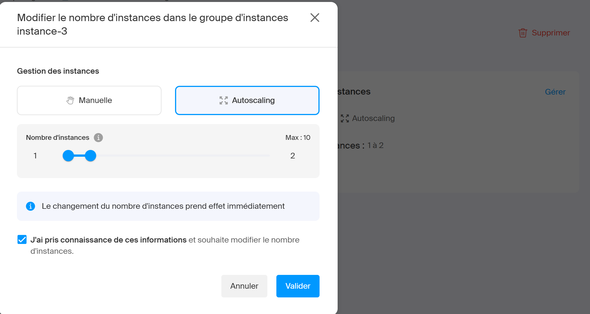

Infomaniak surveille en permanence les pods en état `Pending` — c'est-à-dire des pods qui ne trouvent pas de nœud avec suffisamment de ressources pour démarrer. Quand cette situation se produit, un nouveau nœud est automatiquement provisionné pour les accueillir. À l'inverse, quand un nœud est sous-utilisé sur une période prolongée, il est supprimé pour réduire les coûts.

> **Note :** Le cluster autoscaling opère au niveau **infrastructure** (ajout/suppression de VMs). Il est complémentaire au HPA Kubernetes qui opère au niveau **applicatif** (ajout/suppression de pods). Le HPA n'a pas été configuré sur ce projet en raison des contraintes de ressources de l'instance gratuite Infomaniak (1 vCPU / 2Go RAM) — le Metrics Server requis par le HPA consomme à lui seul 100m CPU et 200Mi RAM, ce qui saturerait le nœud. Sur un cluster de production avec des nœuds plus généreux, on configurerait un HPA sur le Deployment `authapp-backend` avec `minReplicas: 1`, `maxReplicas: 3` et `targetCPUUtilizationPercentage: 70`.

## 📊 Monitoring (Grafana + Prometheus)

La stack de monitoring est installée via Helm dans le namespace `monitoring` :
```bash
helm repo add prometheus-community https://prometheus-community.github.io/helm-charts
helm repo update
helm install monitoring prometheus-community/kube-prometheus-stack \
  --namespace monitoring \
  --create-namespace \
  --set prometheus.prometheusSpec.resources.requests.memory=200Mi \
  --set prometheus.prometheusSpec.resources.requests.cpu=100m \
  --set grafana.resources.requests.memory=100Mi \
  --set grafana.resources.requests.cpu=50m \
  --set alertmanager.enabled=false \
  --set prometheus.prometheusSpec.retention=6h
```

Accès à Grafana via port-forward :
```bash
kubectl --namespace monitoring port-forward service/monitoring-grafana 3000:80
```
Puis ouvrez `http://localhost:3000` (login: `admin`).

Récupérer le mot de passe admin :
```bash
kubectl --namespace monitoring get secrets monitoring-grafana \
  -o jsonpath="{.data.admin-password}" | base64 -d
```

Dashboards préconfigurés utiles pour la soutenance :
- **Kubernetes / Compute Resources / Namespace (Pods)** → sélectionner namespace `authapp` pour voir CPU/RAM de chaque pod en temps réel
- **Kubernetes / Compute Resources / Node (Pods)** → consommation globale du nœud
- **Node Exporter / Nodes** → métriques système (CPU, RAM, disque, réseau)

### Stack technique
| Service  | Technologie                    | Rôle                                   |
| -------- | ------------------------------ | -------------------------------------- |
| Frontend | HTML/CSS/JS + Three.js + Nginx | SPA avec scène 3D et routing           |
| Backend  | Node.js + Express              | API REST + authentification JWT        |
| BDD      | MongoDB 7                      | Stockage des utilisateurs (ReplicaSet) |
| Infra    | Docker + Kubernetes            | Conteneurisation et orchestration      |
| Monitoring | Uptime Kuma | Surveillance de disponibilité des services |
### Fonctionnement de l'authentification (JWT)
1. L'utilisateur s'inscrit ou se connecte.
2. Le serveur renvoie un **token JWT** signé (expire en 24h).
3. Le frontend stocke le token dans `localStorage`.
4. Les requêtes protégées envoient le header : `Authorization: Bearer <token>`.
5. Le middleware `auth.js` vérifie et décode le token.

> [!IMPORTANT]
> Pour les besoins de ce projet, nous avons choisi une approche simple de stockage du token en `localStorage`. En production, il est recommandé d'utiliser des **cookies HttpOnly** pour une meilleure sécurité contre les attaques XSS.


### API Endpoints
| Méthode | Route              | Auth ? | Description       |
| ------- | ------------------ | ------ | ----------------- |
| POST    | /api/auth/register | Non    | Inscription       |
| POST    | /api/auth/login    | Non    | Connexion         |
| GET     | /api/auth/me       | Oui 🔒  | Infos utilisateur |
| GET     | /api/health        | Non    | Health check      |
| Grafana + Prometheus | kube-prometheus-stack (Helm) | Métriques et dashboards du cluster |

### Interface 3D (Frontend)
Le frontend intègre une scène **Three.js** interactive sur la page d'accueil pour un rendu cyberpunk : Torus knot métallique avec matériau PBR, wireframe translucide, anneaux orbitaux néon, particules flottantes, lumières dynamiques et suivi de la souris.
